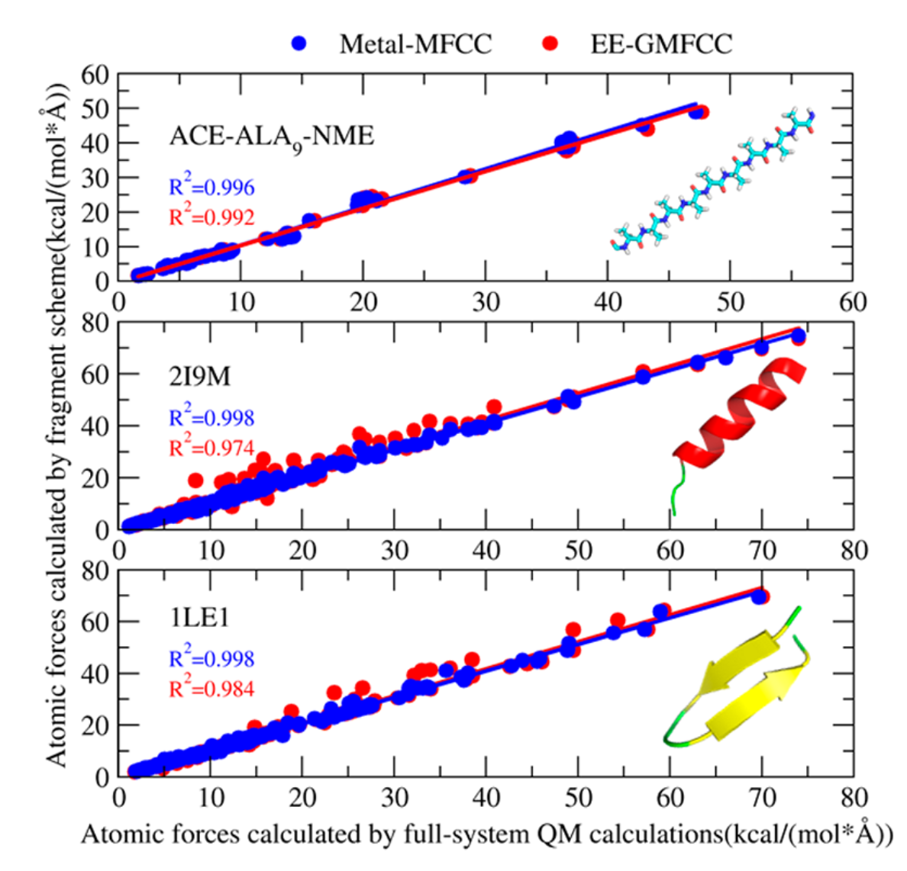
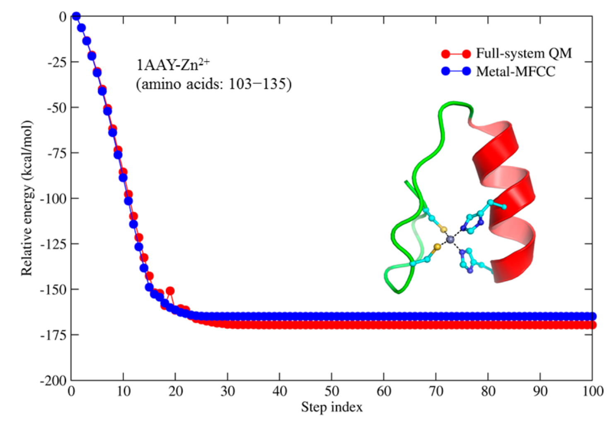

# Metal-MFCC

## Description 

Metal molecular fractionation with conjugate caps (Metal-MFCC) approach is developed for efficient linear-scaling quantum calculation of potential energy and atomic forces of metalloprotein. In this approach, the potential energy of a given protein is calculated by a linear combination of potential energies of the neighboring residues, two-body interaction energy between non-neighboring residues that are spatially in close contact and the potential energy of the metal binding group. The calculation of each fragment is embedded in a field of point charges representing the remaining protein environment.

## Metal-MFCC for protein 

## Metal-MFCC for Metalloprotein 

## Reference:
* Xu, M.;  Zhu, T.; Zhang, J. Z. H., A Force Balanced Fragmentation Method for ab Initio Molecular Dynamic Simulation of Protein. Front. Chem. 2018, 6, 189.
* Xu, M.;  He, X.;  Zhu, T.; Zhang, J. Z. H., A Fragment Quantum Mechanical Method for Metalloproteins. J. Chem. Theory Comput. 2019, 15 (2), 1430-1439.
